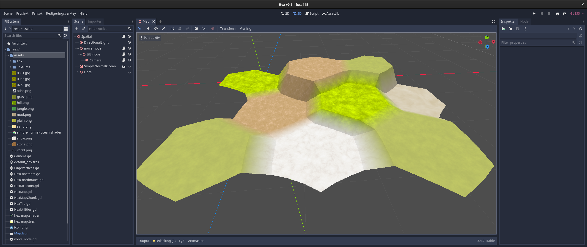

# Godot 3D hex map

To use it, add the `HexMap.gd` script to a spatial node. That script simply creates a random map, so you need to look at the `create_tile` function and the corresponding call-tree to change the map creation to your needs.